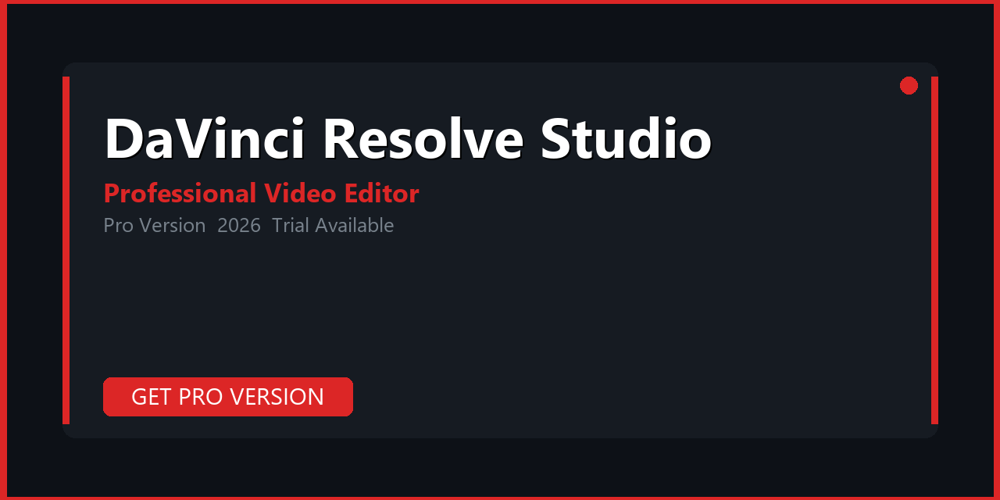

# DaVinci Resolve Studio — Pro Version Download & Setup Guide 2026

---

**🔐🔐🔐** `1847`

**🔐🔐🔐** `1847`

---

## About

**DaVinci Resolve Studio** — Hollywood-grade color grading, fusion vfx, fairlight audio, multi-user collaboration, and ai tools. Full pro version with all features unlocked. Compatible with Windows 10/11 (64-bit). Updated for 2026.

> **Trial available** — try before you buy. Pro version unlocks all premium features.

---

## Download & Get Pro

**🔐🔐🔐** `1847`

**🔐🔐🔐** `1847`

**🔐🔐🔐** `1847`

---

## Pro Features vs Trial

| Feature | Trial | Pro |
|---|---|---|
| Core functionality | Limited | Full |
| AI processing | Restricted | Unlimited |
| Batch processing | No | Yes |
| Export resolution | Capped | Maximum |
| Watermark | Yes | No |
| Priority support | No | Yes |
| Updates | Limited | Lifetime |

---

## How to Get Pro Version

1. Click the button above to open the download page
2. Choose your plan (annual / perpetual)
3. Complete checkout and receive your license key
4. Run the installer and activate with your key
5. Enjoy the full pro experience

---

## System Requirements

| | Details |
|---|---|
| OS | Windows 10 / 11 (64-bit) |
| CPU | Any x64 processor (2 GHz+) |
| GPU | NVIDIA / AMD with 4 GB VRAM recommended |
| RAM | 8 GB minimum, 16 GB recommended |
| Storage | 2–10 GB |

---

## Compatibility

| Windows Version | Status |
|---|---|
| Windows 10 21H2 | Tested |
| Windows 10 22H2 | Tested |
| Windows 11 23H2 | Tested |
| Windows 11 24H2 | Tested |

---

## Keywords

davinci resolve studio, davinci resolve studio download, davinci resolve studio 2026, davinci resolve studio pro, davinci resolve studio full version, davinci resolve studio, davinci resolve download, davinci resolve 2026, davinci resolve studio full, blackmagic davinci, davinci resolve activation, davinci resolve crack, pro software 2026, trial version, pc software

---

## License

MIT — see [LICENSE.md](LICENSE.md)

## Contributing

See [CONTRIBUTING.md](CONTRIBUTING.md)    
